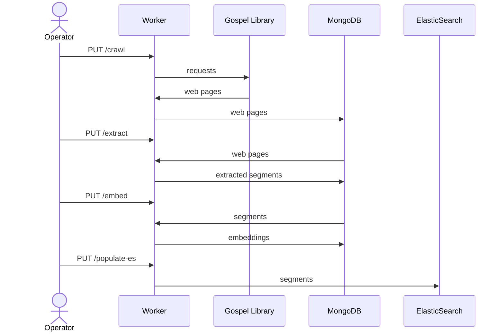
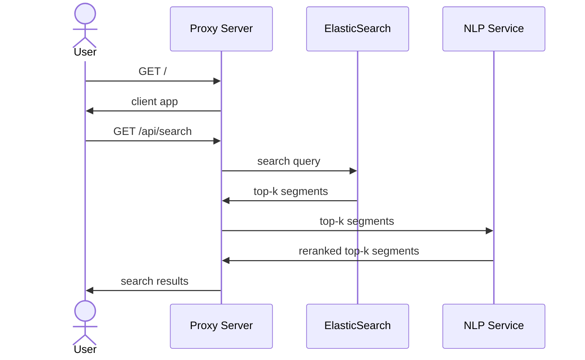

# Gospel Search

The architecture of this project is broken up into two separate workflows: the data transformation pipeline, and the online search engine user experience.

## Data Transformation Pipeline

The data transformation pipeline can be started up via:

```shell
scripts/start-db.sh
```

HTTP requests can then be made to the worker service at `http://localhost:8080` to accomplish the steps outlined in the following sequence diagram:



**Note**: Currently the ElasticSearch index is not persisted across docker image start-ups, so `PUT /populate-es` has to be called every time ElasticSearch starts up. That command only takes 10 or so seconds to run, so its not a big deal.

## Search Engine User Experience

Once the embeddings have been saved to the MongoDB instance and the segments have been loaded into the ElasticSearch instance, the search engine application stack can be started via:

```shell
scripts/start-service.sh
```

The front-end UI can then be accessed via `http://localhost:3000`. User requests are handled using this workflow:



# Overview of directory structure:

- `gospel_search/elasticsearch/`: The code related to the ElasticSearch search engine server.
- `gospel_search/mongodb/`: The code related to the MongoDB database which stores all the segments and embedding vectors.
- `gospel_search/nextjs`: The code for the proxy server and user interface.
- `gospel_search/nlp_server`: The code for the NLP paragraph embedding re-ranking server.
- `gospel_search/web_scraping`: The code for the HTML scraper.
- `gospel_search/worker`: The code for the worker server which runs all the ETL tasks.

### Notes

The church has a new public API you can use, which looks like this:

```
curl 'https://www.churchofjesuschrist.org/study/api/v3/language-pages/type/content?lang=eng&uri=/general-conference/1971/04/life-is-eternal'
```

You can also fetch the index page for a session using e.g.:

```
curl 'https://www.churchofjesuschrist.org/study/api/v3/language-pages/type/content?lang=eng&uri=/general-conference/1971/04'
```

The `body` field has the html string with the page content. And there's a `footnotes` property.
