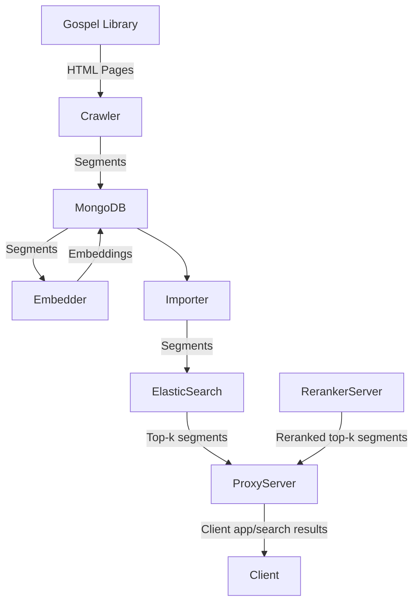

# Gospel Search

Here is the 10,000 foot view of the architecture:

# Overview of directory structure:

- `gospel_search/elasticsearch/`: The code related to the ElasticSearch search engine server.
- `gospel_search/mongodb/`: The code related to the MongoDB database which stores all the segments and embedding vectors.
- `gospel_search/nextjs`: The code for the proxy server and user interface.
- `gospel_search/nlp_server`: The code for the NLP paragraph embedding re-ranking server.
- `gospel_search/web_scraping`: The code for the HTML scraper.
- `gospel_search/worker`: The code for the worker server which runs all the ETL tasks.

### TODO: left off getting the ElasticSearch index to persist across docker restarts.
